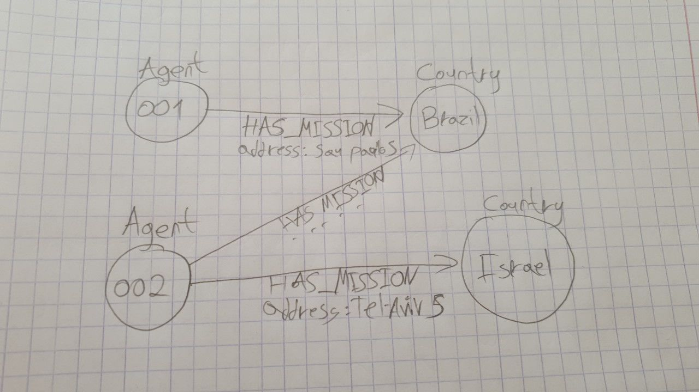

# Tikal coding challenge - Snir David
Welcome to my solution for the tikal coding challenge.

The challenge is defined as such:
Given a data set of agents operating in different countries we need to apply 2 endpoints;
1. Finds the most isolated country
2. Finds the closest and furthest missions from a specific address.

- [Tikal coding challenge - Snir David](#tikal-coding-challenge---snir-david)
    - [The data set](#the-data-set)
    - ["isolated" country definition](#isolated-country-definition)
  - [Tech stack](#tech-stack)
    - [Why Koa](#why-koa)
    - [Why jest](#why-jest)
    - [Why vuejs](#why-vuejs)
  - [Data storage](#data-storage)
    - [The `agents` table](#the-agents-table)
    - [The `missions` table](#the-missions-table)
  - [Algorithms implementation details](#algorithms-implementation-details)
    - [Most isolated country](#most-isolated-country)
    - [Find closest and furthest missions from an address](#find-closest-and-furthest-missions-from-an-address)

### The data set
The missions dataset consists of:
- Agent id
- Country
- Address
- Date

A sample instance:
```js
{
    agent_id: '007', country: 'Brazil', 
    address: 'Avenida Vieira Souto 168 Ipanema, Rio de Janeiro',
    date: 'Dec 17, 1995, 9:45:17 PM'
}
```

### "isolated" country definition
For the first endpoint we need to define what is isolated.
Isolated country is defined by the amount of agents that only ever operated in that country.
For simplification, if we have this dataset:
```js
[
    {
        agent_id: "001",
        country: "Israel"
    }
        {
        agent_id: "001",
        country: "Brazil"
    }
        {
        agent_id: "002",
        country: "Brazil"
    }
]
```
Then we have isolation degrees of `Brazil: 1` and `Israel: 0`, as 001 agent is not an isolated agent.

## Tech stack
Coming to implement this challenge, I'll do something not recommended usually but exciting for me.
My experience is with expressjs, testing with Mocha and Sinon, and from with reactjs (and backbonejs before that but thats prehistoric).
I'll take up the challenge to use more modern stack that I've been curious about: koajs, jest for testing and vuejs.

### Why Koa
I want to leverage the use of async-await within koa to potentially provide a more readable and convinient code.

### Why jest
The leading test library that provides everything with itself.
It has more documentation these days and easier integration with frameworks.

### Why vuejs
React is going strong on the functional programming patterns with pure function.
These patterns adds some ceremony and boilerplate. Especially once you go to a more complex app with state management using Redux.
Vuejs, from what I heard so far, is simpler and does not afraid to tie and tightly couple certain parts of the app for convinience, which is sometimes the better path for a simple web app.

## Data storage
I will use a classic relational database for this task, in my case postgresql.
Given the plausible scale of such application, managing agents missions, I do not believe it will outgrow a relational db solution.
Nor do I see anywhere a need for caching layer like redis for high speed reads.

We will have 2 distinct tables:
1. Agents
2. Missions

### The `agents` table
- Primary Key `id` - stores the agent id

### The `missions` table
- Primary Key `id` - mission id
- Foreign key `agent_id`
- String `country`
- Float `longtitude`
- Float `latitude`

(As you can see, I will store longtitude and latitude directly, which means I will have a module translating back and forth from real address)

## Algorithms implementation details
### Most isolated country
I need to find the country with the highest isolation degree - meaning the country which have the highest amount of agents that only operated in that country.
Normally, this will require going through all the missions and looking at the agent and country for each, then filtering by agents with missions only in one country and then group by country and order.
The sql query for such thing will look something like that:
```sql
 SELECT Count(country) AS isolated_agents_in_country,
       country
-- Subquery for getting isolated agents and their countries
FROM   (SELECT agent_id                AS agent_id,
               Count(DISTINCT country) AS countries_operated_in,
               Max(country)            AS country
        FROM   missions
        GROUP  BY agent_id) AS agents_country_operations
WHERE  agents_country_operations.countries_operated_in = 1
GROUP  BY country
ORDER  BY isolated_agents_in_country DESC
LIMIT  1 
```

You can play around with a limited data set of this query here:
https://www.db-fiddle.com/f/bFc4HwmTRoPx2AWWmJcYAq/0

This query will run at time complexity of:
O(N) - for all missions and finding isolated agents
O(M) - for summing all isolated agents, worst case all missions are for isolated agents then M = N
So we get O(2N) = O(N)

We can potentially do better by using a graph data structure to store this data



Stroring in this data structure, while keeping counters of node connections and secifically of distinct counting by country, will allow us to find isolated counts per country in potentially even O(1). Depends on how we store it. (Neo4j have some cool features around it).

This is just to demonstrate that if the system is read-heavy, we can optimize for reads by scarificing some space and ofcourse adding complexity to insertion that will have to update counters and indexes all over the place.

I'll go with the above, less time efficient solution for this implementation for now as it is good enough.

### Find closest and furthest missions from an address
Calculating distance is hard. Especially for locations on a map.
The traditional longtitude-latitude points will be inaccurate when comparing distances since those are degrees distance on a spherical plane.
Therefore, the distance from (10,10) to (20,20), is less than from (20,20) to (10,10).
So we cannot use the known algorithms for finding nearest and furthest points that allow O(nlogn) complexity.
In order to do that, we will need a more absolute location pointer (which exists by the way) of 3 points. But then we will need to modify the nearest-furthest algorithm to work on higher dimentional points and for our scope here, it is crazy.

So I will simply use the [distance matrix](https://developers.google.com/maps/documentation/distance-matrix/start) API provided by Google Maps.
For any address that will be put into the endpoint, I will calculate distance to every mission distance and take max and min.
This will be O(n) time complexity, where n is the amount of missions we have.

